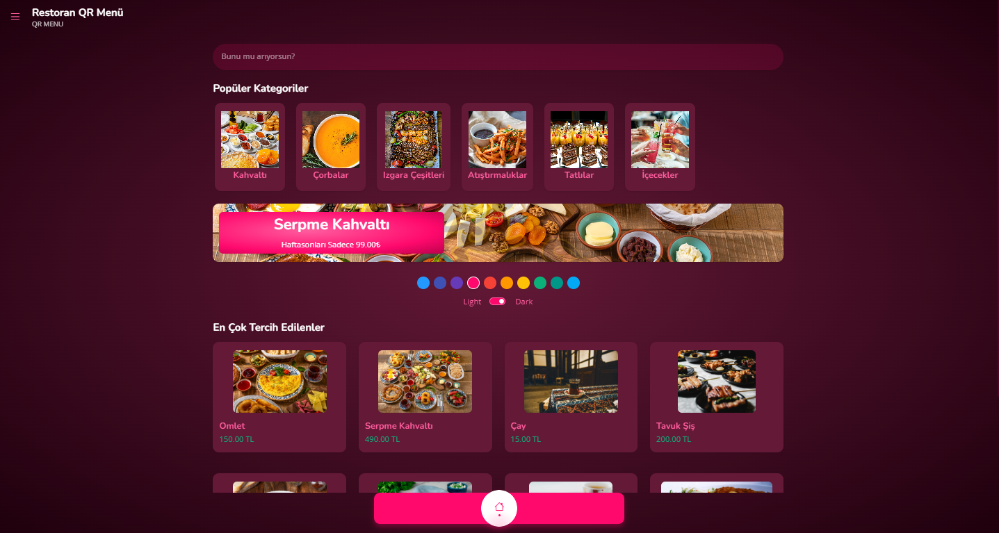

# Restoran QR Menü Yönetim Sistemi

Bu proje, restoranlar için QR kod tabanlı bir menü yönetim sistemi sağlar. Kullanıcılar ürünleri ve kategorileri görüntüleyebilir, arama yapabilir ve yönetim paneli üzerinden içerikleri düzenleyebilir.

## Özellikler

- **Ürün Yönetimi**: Ürün ekleme, düzenleme, silme ve fotoğraf yönetimi.
- **Kategori Yönetimi**: Kategori ekleme, düzenleme, silme ve fotoğraf yönetimi.
- **Arama Fonksiyonu**: Ürünler arasında hızlı arama yapma.
- **Admin Paneli**: Kullanıcı adı ve şifre güncelleme, site ayarlarını düzenleme.
- **Bakım Modu**: Siteyi bakım moduna alma seçeneği.
- **Responsive Tasarım**: Mobil cihazlar için optimize edilmiş kullanıcı arayüzü.

## Kurulum

1. **Depoyu Klonlayın**:
   ```bash
   git clone https://github.com/nurihankrl/restoranQrMenuSystem.git
   ```

2. **Veritabanını Ayarlayın**:
   - `database.sql` dosyasını MySQL veritabanınıza içe aktarın.
   - `inc/main.php` dosyasındaki veritabanı bağlantı ayarlarını düzenleyin:
     ```php
     $db = new PDO('mysql:host=localhost;dbname=veritabani_adi;charset=utf8', 'kullanici_adi', 'sifre');
     ```

3. **Yükleme Dizini**:
   - `uploads` klasörünün yazılabilir olduğundan emin olun:
     ```bash
     chmod -R 777 uploads
     ```

4. **XAMPP Üzerinde Çalıştırın**:
   - Projeyi `htdocs` dizinine taşıyın.
   - Tarayıcınızda `http://localhost/restoranQrMenuSystem` adresine gidin.

## Kullanım

### Admin Paneli
- **Giriş Yapın**: Admin paneline giriş yapmak için varsayılan kullanıcı adı ve şifreyi kullanın:
  - Kullanıcı Adı: `admin`
  - Şifre: `123`
- **Ürün ve Kategori Yönetimi**: Ürün ve kategorileri ekleyin, düzenleyin veya silin.
- **Ayarlar**: Site başlığını ve logosunu değiştirin, bakım modunu etkinleştirin.

### Kullanıcı Arayüzü
- **Ürün Görüntüleme**: QR kod ile ürün detaylarına erişin.
- **Kategori Görüntüleme**: Kategorilere göz atın ve ürünleri listeleyin.
- **Arama**: Ürünler arasında hızlıca arama yapın.

## Teknolojiler

- **Backend**: PHP (PDO ile MySQL bağlantısı)
- **Frontend**: HTML, CSS, Bootstrap, JavaScript
- **Veritabanı**: MySQL
- **Diğer**: Swiper.js (slider için)

## Ekran Görüntüleri

### Ana Sayfa


### Admin Paneli


## İletişim

Herhangi bir sorunuz veya öneriniz varsa, lütfen benimle iletişime geçin:

- **E-posta**: [nurihankrl07@gmail.com](mailto:nurihankrl07@gmail.com)
- **Linkedln**: [linkedin.com/in/nurihankarul/](https://www.linkedin.com/in/nurihankarul/)
